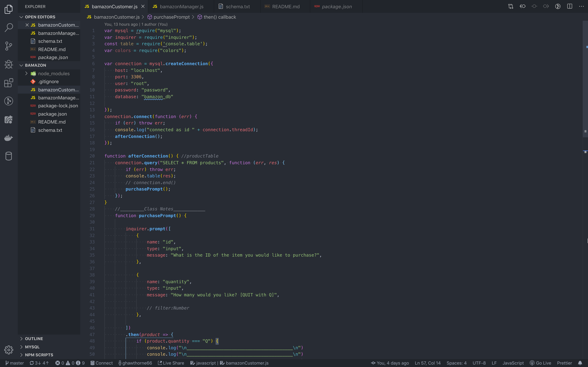

# Bamazon Customer and Manager Store
An interactive storefront that runs in the console using node.

## Bamazon Customer/ Manager: 

[YouTube Link](https://youtu.be/1krNNTd-bHM)

## How it works: 
This program consists of two separate, but related apps.  The first, BamazonCustomer.js, allows a "customer" to place an order from the Bamazon store.  A check is then performed on the store inventory and the customer is either alerted that their order cannot be completed, or they are shown the total amount owed (but no credit card number is requested).  Behind the scenes, the quantity ordered by the customer is deducted from the store quantity (which is stored in a SQL table).  At the same time, the $ amount of the order is sent to separate SQL table to allow the managers to access and modify products and inventory.
